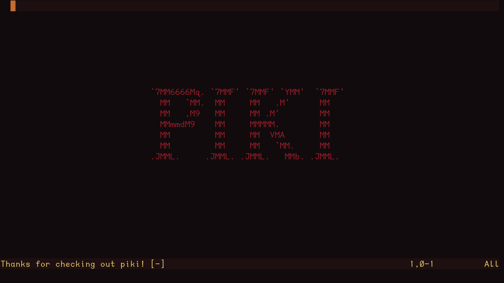

# piki




`piki` is an opinionated Neovim wiki plugin. It contains a ***picky*** selection of features from [womwiki](https://github.com/wom/womwiki) and Obsidian, built around my own day-to-day and how my brain works.

**This plugin makes no assumptions about directory structure or desired features.** Everything is explicitly opt-in. See [Configuration](#configuration) for details.

Most wiki-style Neovim plugins lock you into a certain directory structure, link style, and set of features. `piki` maintains the philosophy that it should be up to the users what they do and do not want in a plugin. I've tried a few other wiki-style plugins, but none of them fit my directory structure or workflow, or were otherwise bloated with features I didn't need or want with keymaps I couldn't disable or that conflicted with my existing config.

`piki` is NOT meant to be a drop-in replacement for most people's workflows. It borrows ideas from the time I used Obsidian for daily learning, implementing a core set of features I wanted to bring with me to Neovim. `womwiki` had most of those features and was well-structured enough to build on.

This plugin is highly configurable, which does mean it can adapt to a wide range of workflows and can be supplemented with other markdown-focused Neovim plugins.

## Features
### Default
These features are available as soon as piki is installed and a wiki directory is configured.

- **Wikilinks** — `[[Page Name]]` syntax with fuzzy resolution. Follows links with `gf`, prompts to create missing files on follow.
- **Backlinks** — find every file in your wiki that links to the current note.
- **Wiki graph** — an at-a-glance summary of your wiki: total files, links, orphaned notes, and broken links. Includes actions to browse orphans, hubs, and broken links, and to trigger link validation.
- **Rename & refactor** — rename a file and automatically update all inbound links across your wiki, for both wikilink and markdown link syntax.
- **Picker menu** — a unified entry point into your wiki. Works with telescope, fzf-lua, mini.pick, and snacks (auto-detected).

### Opt-in
These features are disabled by default and can be enabled individually in your config.

#### Daily Notes

- **Daily Note** — open today's note from anywhere with a single keymap. Supports a user-defined template, with a sensible default if none is set.
- **Todo rollover** — when opening today's note, incomplete `([ ])` and in-progress `([>])` todos are automatically carried forward from yesterday. Rolled-over todos are marked `[>]` in the previous note.
- **Calendar** — a month view for navigating your daily notes visually.
- **Daily note navigation** — previous/next keymaps for moving between daily notes, available when inside a daily note buffer.

#### Links & Navigation

- **Markdown links** — `[text](file)` style links as an alternative or complement to wikilinks. Configurable as the default link style.
- **Wordlink** — create a link from the word under your cursor.

#### Tags

- **Inline tags** — `#tag` syntax with a configurable pattern.
- **Frontmatter tags** — YAML frontmatter tag support, browseable and filterable via your picker.

#### Completion

- **Link, heading, and tag completion** — autocomplete for wikilinks, markdown links, headings, and tags. Works with blink.cmp, nvim-cmp, and native Neovim completion.

#### Markdown Helpers

- **Markdown keymaps** — `gf` link following, checkbox toggling, and wordlink, scoped to markdown buffers only. Disabled outside of markdown files.

## Requirements
- Neovim >= 0.10
- A picker (telescope, fzf-lua, mini.pick, or snacks) if you intend to use search or navigation
- A completion plugin (blink-cmp, nvim-cmp) or native neovim completion if you want to use link/tag/heading completion

## Installation
vim.pack:
```lua
-- vim.pack (built-in, Neovim 0.11+)
vim.pack.add({ "https://github.com/n-samaniego/piki" })

-- and,
vim.cmd("packadd piki")

-- with a setup call to set your configuration
require("piki").setup({

    })
```

## Configuration
To use this plugin with the built-in features, there is one option that needs to be set for it to work. A minimal viable setup call is as follows:
```lua
require("piki").setup({
    path = "~/path/to/your/notes/"
    })
```

There are many other fields to configure, but if you `require` the plugin without setting a path to your notes directory, the plugin will give you an error. The following dropdown contains the default configuration; you need only to include the fields you want to set/change in your own config:
<details>
  <summary>Full Config Table:</summary>

  ```lua
  require("piki").setup({
  	-- path MUST be set for the plugin to work
    path = nil, -- takes a string. "~path/to/your/notes/"
  	picker = nil, -- can explicitly set picker, nil autodetects
  	completion = {
  		enabled = false, -- completion off by default
  		include_headings = true,
  		max_results = 50,
  		cache_ttl = 300,
  	},
    markdown_help = false, -- flag to enable markdown help keybinds
  	wikilinks = {
  		enabled = true,
  		spaces_to = "-", -- if filename has spaces, they get replaced
  		confirm_create = true,
  	},
  	tags = {
  		enabled = false,
  		inline_pattern = "#([%w_-]+)", -- tags gets parsed without the #
  		use_frontmatter = true,
  	},
  	default_link_style = "wikilink", -- can be set to "markdown"
    daily = {
        -- path takes a string to your daily note directory
        path = nil, -- to set, replace nil with "~/path/to/daily/notes/"
        -- template_path takes a string to your template file
        template_path = nil, -- replace with "~/path/to/template.md"
      },
    keymaps = {
        -- default keymaps, user configurable
        -- can be set to false to disable individually
        global = {
            picker = "<leader>w", -- piki menu, alternative to using keybinds
            backlinks = "<leader>wb",
            graph = "<leader>wg",
            calendar = "<leader>dc",
            open = "<leader>dn",
        },
        markdown = {
            wordlink = "<leader>wl",
            togglecheck = "<CR>", -- AKA `Enter` or `Return`
            follow = "gf",
        },
        daily = {
            prev = "<leader>dh",
            next = "<leader>dl",
            close = "<leader>dq",
        },
    }
  })
  ```
</details>

## Contributions
Contributions and bugfixes are welcome! This is a passion project, but any/all PR's and feature requests will be considered.

## Acknowledgements
AI was heavily used in the development of this plugin. I used Claude and Github Copilot as sounding boards for my ideas, to help me with lua syntax and neovim functions, and to debug my functions. I am a relatively new programmer, so it was very helpful.

## License
MIT — see [LICENSE](LICENSE) for details.
Original work copyright (c) 2025 wom.
